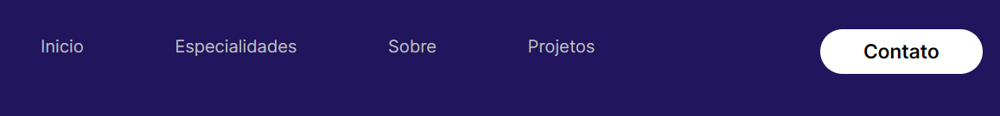

# portifolio
adicionei a aba tecnológia e adicionei meu melhores trabalhos com o slider e slides + script em js para animação automática
adição de borda e troca de cores

##

Modificação 25/11
- Add: Redes Socias e aumento de margem-espaçamento e efeito do cursor nos icons da redes

    

- e os botões seguem sem função ainda...

    

- Add: bootstrap.min.css

##

Modificação 01/12
- Add: Função para os Botões para as páginas correspondente

    
    

- Add: Quando um desses links é clicado, ele anima a rolagem para a seção correspondente usando a opção behavior: 'smooth'. Assim criando o efeito deslizante

    

##

Modificação 08/12
- Add: Botão que muda o visual do site para modo escuro e modo normal

    

**- Add:** Novas cores ao design do portfólio, proporcionando uma aparência vibrante e atrativa

    --cor-primaria: #5901d8; /* Cor primária utilizada para destaques e elementos-chave */
    --cor-secundaria: #ffc409; /* Cor secundária, adiciona destaque e contraste */
    --cor-fundo: #1e1e1e; /* Cor de fundo principal, fundo do modo escuro */
    --cor-texto: #d0d0d0; /* Cor do texto principal, proporciona legibilidade no modo escuro */
    --cor-sombra: #ffffff25; /* Cor da sombra usada para elementos sombreados */

- Como Ficou:

